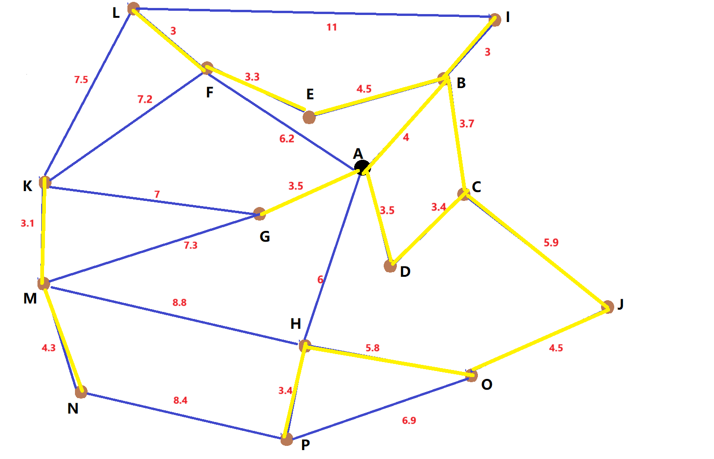

# 任务目标


## 基于Gurobi的VRP试跑

```python
import gurobipy
from gurobipy import GRB
import numpy

# https://zhuanlan.zhihu.com/p/651080846

# 边的定义和距离矩阵的初始化
edges = {
    (0, 1): 4, (0, 3): 3.5, (0, 5): 6.2, (0, 7): 3.5, (0, 8): 6,
    (1, 2): 3.7, (1, 4): 4.5, (1, 9): 3,
    (2, 3): 3.4, (2, 10): 5.9,
    (4, 5): 3.3,
    (5, 10): 7.2, (5, 11): 3,
    (6, 10): 7, (6, 12): 7.3,
    (7, 12): 8.8, (7, 14): 5.8, (7, 15): 3.4,
    (8, 11): 11,
    (9, 14): 4.5,
    (10, 12): 7.5, (10, 13): 3.1,
    (12, 13): 4.3,
    (13, 15): 8.4,
    (14, 15): 6.9
}

distances = numpy.full((16, 16), GRB.INFINITY)
for k, v in edges.items():
    i, j = k
    distances[i][j] = v
    distances[j][i] = v

numpy.fill_diagonal(distances, 0) # 自己到自己的距离为0

# 问题参数：客户数量和车辆数
n = 15  # 客户点数目
m = 3   # 车辆数目

# 创建优化模型
model = gurobipy.Model("VRP")

# 决策变量：X[k, i, j] 表示车辆k是否从i点行驶到j点
X = model.addVars(m, 1 + n, 1 + n, vtype=GRB.BINARY, name='X')

# 目标函数：最小化总行驶距离
objFunc = gurobipy.quicksum(
    distances[i, j] * X[k, i, j]
    for k in range(m)
    for i in range(n + 1)
    for j in range(n + 1)
)

model.setObjective(objFunc, GRB.MINIMIZE)

# 约束条件：每辆车从起点出发
for k in range(m):
    model.addConstr(gurobipy.quicksum(X[k, 0, j] for j in range(1, n + 1)) == 1)

# 约束条件：每辆车必须回到起点
for k in range(m):
    model.addConstr(gurobipy.quicksum(X[k, j, 0] for j in range(1, n + 1)) == 1)

# 流量平衡约束：每个客户点的进出流量必须相同
for k in range(m):
    for j in range(1, n + 1):
        model.addConstr(
            gurobipy.quicksum(X[k, i, j] for i in range(n + 1) if i != j) ==
            gurobipy.quicksum(X[k, j, i] for i in range(n + 1) if i != j)
        )

# 访问所有客户点的约束：每个客户点必须被访问一次
for j in range(1, n + 1):
    model.addConstr(
        gurobipy.quicksum(X[k, i, j] for k in range(m) for i in range(n + 1) if i != j) == 1
    )

# 禁止不可达的路径
for k in range(m):
    for i in range(n + 1):
        for j in range(n + 1):
            if distances[i, j] == GRB.INFINITY:
                model.addConstr(X[k, i, j] == 0)
            if i == j:
                model.addConstr(X[k, i, j] == 0)

# https://zhuanlan.zhihu.com/p/159270139
# 子回路消除约束：基于 MTZ
U = model.addVars(m, 1 + n, lb=0, ub=n, vtype=GRB.INTEGER, name='U')

# MTZ 约束：防止车辆走子回路
for k in range(m):
    for i in range(1, n + 1):
        for j in range(1, n + 1):
            if i != j:
                model.addConstr(U[k, i] - U[k, j] + n * X[k, i, j] <= n - 1)

# 起点顺序号为0
for k in range(m):
    model.addConstr(U[k, 0] == 0)

# 更新模型并求解
model.update()
model.optimize()

# 检查是否找到最优解
if model.status == GRB.OPTIMAL:
    print(f"最小总行驶距离: {model.objVal}")
else:
    print(f"没有找到最优解，状态码: {model.status}")
```

### 结果
```text
Restricted license - for non-production use only - expires 2025-11-24
Gurobi Optimizer version 11.0.3 build v11.0.3rc0 (win64 - Windows 10.0 (19045.2))

CPU model: AMD Ryzen 7 5800H with Radeon Graphics, instruction set [SSE2|AVX|AVX2]
Thread count: 8 physical cores, 16 logical processors, using up to 16 threads

Optimize a model with 1317 rows, 816 columns and 4626 nonzeros
Model fingerprint: 0xd9009c8d
Variable types: 0 continuous, 816 integer (768 binary)
Coefficient statistics:
  Matrix range     [1e+00, 2e+01]
  Objective range  [3e+00, 1e+100]
  Bounds range     [1e+00, 2e+01]
  RHS range        [1e+00, 1e+01]
Warning: Model contains large objective coefficients
         Consider reformulating model or setting NumericFocus parameter
         to avoid numerical issues.
Presolve removed 621 rows and 621 columns
Presolve time: 0.00s
Presolved: 696 rows, 195 columns, 1815 nonzeros
Variable types: 0 continuous, 195 integer (150 binary)

Root relaxation: objective 9.320000e+01, 95 iterations, 0.00 seconds (0.00 work units)

    Nodes    |    Current Node    |     Objective Bounds      |     Work
 Expl Unexpl |  Obj  Depth IntInf | Incumbent    BestBd   Gap | It/Node Time

     0     0   93.20000    0   24          -   93.20000      -     -    0s
     0     0 infeasible    0               - infeasible      -     -    0s

Cutting planes:
  Learned: 6
  Implied bound: 29
  Clique: 26
  MIR: 10
  Zero half: 1
  Relax-and-lift: 8

Explored 1 nodes (162 simplex iterations) in 0.02 seconds (0.01 work units)
Thread count was 16 (of 16 available processors)

Solution count 0

Model is infeasible
Best objective -, best bound -, gap -
没有找到最优解，状态码: 3
```

## 基于Gurobi的MST试跑
```python
import gurobipy
from gurobipy import GRB

# 点数目
n = 16
# 点名字
nodes = [chr(x) for x in range(n + 65)]

# 距离邻接矩阵
edges = [
    ('A', 'B', 4), ('A', 'D', 3.5), ('A', 'F', 6.2), ('A', 'G', 3.5), ('A', 'H', 6),
    ('B', 'C', 3.7), ('B', 'E', 4.5), ('B', 'I', 3),
    ('C', 'D', 3.4), ('C', 'J', 5.9),
    ('E', 'F', 3.3),
    ('F', 'K', 7.2), ('F', 'L', 3),
    ('G', 'K', 7), ('G', 'M', 7.3),
    ('H', 'M', 8.8), ('H', 'O', 5.8), ('H', 'P', 3.4),
    ('I', 'L', 11),
    ('J', 'O', 4.5),
    ('K', 'L', 7.5), ('K', 'M', 3.1),
    ('M', 'N', 4.3),
    ('N', 'P', 8.4),
    ('O', 'P', 6.9)
]  # len == 25

# 创建模型
model = gurobipy.Model('mst')

# 建立变量，X[i,j]表示边(i,j)是否被选中
X = model.addVars(edges, vtype=GRB.BINARY, name="X")

# 目标函数：最小化边的权重和
model.setObjective(gurobipy.quicksum(X.select(i, j, '*')[0] * w for i, j, w in edges), GRB.MINIMIZE)

# 添加约束：选择的边数等于节点数减一
model.addConstr(gurobipy.quicksum(X.select(i, j, '*')[0] for i, j, w in edges) == n - 1, "edge_count")

# 求解模型
model.optimize()

# 输出结果
if model.status == GRB.OPTIMAL:
    print("最优解找到")
    ws = 0.0
    for i, j, w in edges:
        if X.select(i, j, '*')[0].X > 0.5:
            print(f"边 ({i}, {j}) 被选中，权重: {w}")
            ws += w
    print("总权重：%f" % ws)
else:
    print("没有找到最优解")

```

### 结果


### 实质结果


## 两类问题的反思
- 约束条件没找齐全
- 没把MTZ方法研究明白


