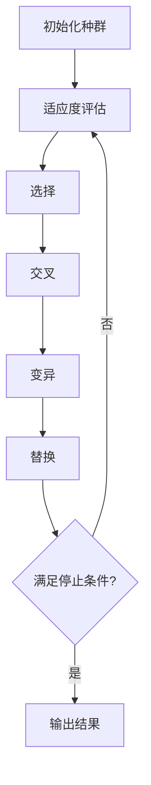

# 遗传算法

## 核心步骤

- 初始化种群：首先，随机生成一个包含多个个体（解）的初始种群。每个个体都代表问题的一个可能解。  
- 适应度评估：对种群中的每个个体进行适应度评估，即计算每个个体的适应度分数，该分数表示个体对于问题的解决方案的优劣程度。  
- 选择：根据适应度分数选择个体，通常是根据适应度分数的高低进行概率性选择，以便更有可能选择到适应度高的个体。常用的选择方法包括轮盘赌选择、锦标赛选择等。  
- 交叉：从被选择的个体中选取一对（或多对）进行交叉操作，生成新的个体。交叉操作模拟了生物界的基因交换过程，可以通过不同的方式进行，如单点交叉、多点交叉、均匀交叉等。  
- 变异：对交叉后的个体进行变异操作，以保持种群的多样性。变异操作是随机改变个体染色体中的一些基因，以产生新的解。常见的变异操作包括基因翻转、基因位移、基因重组等。  
- 替换：用新生成的个体替换原来的个体，形成新一代种群。替换策略可以是全局替换（直接用新生成的个体替换原有种群）或局部替换（保留一部分原有个体，只替换其中一部分）。  
- 重复迭代：重复执行步骤 2 到步骤 6，直到达到停止条件（如达到最大迭代次数、找到满意的解等）为止。  
- 输出结果：在停止迭代后，输出最终的优化结果，通常是种群中适应度最高的个体所对应的解。  



## 案例代码

```python
import numpy
import math
import random

# 确定一个目标函数， _max=True表示目标最大值，反之最小值
def objectiveFunc(x : numpy.ndarray, _max : bool = True) -> numpy.ndarray:  # _max表示目标最大值，反之最小值
    d = x * numpy.sin(2 * x) - 5 * x * numpy.cos(x * 2) 
    return d if _max else -1 * d

# 基于均匀分布随机生成种群
def genPop(size : int, start : float, end : float) -> numpy.ndarray:
    return numpy.random.uniform(start, end, size)

# 选择操作，根据method指定的策略来，默认是轮盘赌方式，可以拓展
def select(pop : numpy.ndarray, size : int, method : str = '轮盘赌', _max : bool = True) -> numpy.ndarray:
    obj = objectiveFunc(pop, _max)
    match method:
        case '轮盘赌':
            minObj = numpy.abs(numpy.min(obj))  # 用于修正
            obj += minObj
            posible = obj / numpy.sum(obj)
            return numpy.random.choice(pop, size, p=posible, replace=False)  # False无放回抽样
        case _:
            ...

# 编码方式
def encode(x: float, start: float, end: float, step: int = 100) -> str:
    """
    把数据平分成step份，然后x落在哪部分，获取对应的二进制值
    :param x: 
    :param start: 
    :param end: 
    :param step: 
    :return: 
    """
    # 先确定二进制范围同时也规定了统一二进制长度，不够补全0
    range_bin = math.ceil(math.log2(step))  # 2^0 ~ 2^range_bin继续写

    # 计算每个区间的长度
    interval_length = (end - start) / step

    # 确定 x 属于哪个区间
    bin_index = min(int((x - start) / interval_length), step - 1)

    # 将区间索引转换为二进制字符串
    bin_str = bin(bin_index)[2:].zfill(range_bin)

    return bin_str

# 与编码方式对应的解码方式，有瑕疵，因为精度问题
def decode(bin_str: str, start: float, end: float, step: int = 100) -> float:
    """
    将二进制字符串解码为原始数值
    :param bin_str: 
    :param start: 
    :param end: 
    :param step: 
    :return: 
    """
    # 先确定二进制范围同时也规定了统一二进制长度
    range_bin = math.ceil(math.log2(step))

    # 将二进制字符串转换为区间索引
    bin_index = int(bin_str, 2)

    # 计算每个区间的长度
    interval_length = (end - start) / step

    # 根据区间索引计算值
    decoded_value = start + bin_index * interval_length + interval_length / 2

    if decoded_value < -4:
        decoded_value = -4
    elif decoded_value > 4:
        decoded_value = 4
    else:
        pass

    return decoded_value

# 交叉策略
# 随机从某点开始连续交叉，用random；交叉默认method方式是的第一个跟第二个交叉，第二个跟第三个交叉，以此类推；
# 交叉的时候采用格外策略：每两个交叉的时候生成1~5个新数据用于填放到新种群，最后在新种群中调用选择选择算法
# length也采用随机策略，可以不定个数交叉, range(1, 3)表示1、2、3个交叉的任意一种
# 而且在生成1~5个新数据是有概率的{1 : 0.75, 2 : 0.2, 3 : 0.03, 4 : 0.015, 5 : 0.005}
# 注意：起点+length一定不会超过编码长度
# method指定交叉方式，可以另行拓展
def cross(
        start: float, end: float, step: int, size: int,
        pop: numpy.ndarray, length: range, method: str = '1-2 2-3 ...', _max : bool = True
) -> numpy.ndarray:
    newGensCodes = []
    # {1 : 0.75, 2 : 0.2, 3 : 0.03, 4 : 0.015, 5 : 0.005}
    lastGenCode = [encode(g, start, end, step) for g in pop]
    mexBinCodeLen: int = math.ceil(math.log2(step))
    for i in range(len(lastGenCode) - 1):
        p1 = list(lastGenCode[i])
        p2 = list(lastGenCode[1 + i])
        haveGenNumbers = numpy.random.choice(numpy.arange(1, 6), size=1, p=[.75, .2, .03, .015, .005])[0]
        # print(haveGenNumbers)
        for j in range(haveGenNumbers):
            random_location = numpy.random.randint(
                0, mexBinCodeLen - random.randint(length.start, length.stop + 1)
            )
            # print(f'random_location = {random_location}')
            # print(f'p1 = {p1}')
            # 交叉得到的两个父类另起变量名字，根据策略当孩子
            for k in range(0, random_location, 1):
                p1[k], p2[k] = p2[k], p1[k]
            # 二者选一入新生代
            p11 = ''.join(p1)
            p21 = ''.join(p2)
            newGensCodes.append(random.choice([p11, p21]))
    returnewGens = [decode(i, start, end, step) for i in newGensCodes]
    return select(numpy.array(returnewGens), size, _max=_max)

# 变异策略，这里更改随机位置的基因
def mutations(pop : numpy.ndarray, start: float, end: float, step: int) -> numpy.ndarray:
    mexBinCodeLen : int = math.ceil(math.log2(step))
    lastGenCodeLists = [list(encode(g, start, end, step)) for g in pop]
    k = []
    g : list
    for g in lastGenCodeLists:
        for i in range(math.ceil(step / pop.size)):  # 保证原种群大小不变
            _s = g[random.randint(0, mexBinCodeLen - 1)]
            s = g.copy()
            s[random.randint(0, mexBinCodeLen - 1)] = '0' if _s == '1' else '1'
            k.append(s)
    return numpy.array(
        [decode(d, start, end, step) for d in [''.join(g) for g in k]]
    )


# 迭代100次试试（即模拟一个种群演变了100代）
_genPop = genPop(1000, -4, 4)
for i in range(100):
    _select = select(_genPop, 100, _max=True)
    _cross = cross(-4, 4, 1000, 100, _select, range(1, 3))
    _mutations = mutations(_cross, -4, 4, 1000)
    _genPop = _mutations
print(_genPop)


"""
[-3.428 -3.428 -3.3   -3.428 -3.94  -1.38  -3.94  -1.38  -3.428 -2.404
 -3.364 -3.364 -3.428 -2.34  -3.364  0.732 -3.428 -3.364 -3.38  -3.372
 -3.212 -3.18   0.916 -3.436 -3.18  -2.156 -3.18  -3.18  -3.18  -3.18
 -3.052 -3.324 -3.196 -3.052 -3.052 -3.06  -3.052 -3.068 -3.068 -3.052
 -3.172 -3.172 -1.124 -3.188  0.924 -3.172 -3.172 -3.18  -3.684 -3.684
 -3.148 -3.02  -3.084 -2.988 -3.02  -0.972 -0.972 -3.02  -3.148 -3.276
 -3.444 -3.364 -3.38  -3.38  -3.38   0.716 -1.332 -3.38  -3.38  -3.38
 -3.284 -3.284 -3.284 -3.284 -3.284 -3.348  0.812 -3.284 -3.796 -3.284
 -3.14  -2.372  0.7   -3.396 -3.364 -3.396 -3.908  0.7   -3.396 -3.404
 -3.38  -3.26  -3.252 -3.236  0.844  0.844 -2.228 -3.252 -3.252 -3.252
 -3.236 -3.372 -3.244 -1.196 -3.244 -3.276 -3.244 -3.244 -3.756 -2.988
 -3.204 -3.204 -3.204 -3.172 -2.18  -3.204 -3.14  -1.156 -3.204 -3.204
 -2.996 -3.252 -3.252 -3.252 -3.38  -3.764 -3.252 -3.252 -3.764 -2.996
 -3.556 -0.996 -3.044 -3.044 -3.172 -3.044 -3.044 -3.044 -3.044 -3.052
 -3.476 -3.348 -3.86  -3.348 -3.348 -3.348 -3.348 -3.348  0.748 -1.3
 -3.06  -3.06  -3.044 -3.044 -3.068 -3.06  -3.06  -2.996 -3.092 -3.06
 -3.188 -2.164 -3.22  -3.188 -3.188 -3.188 -3.444 -3.188 -3.188 -3.188
 -3.908 -3.396  0.7   -2.372 -3.396  0.7    0.7   -3.14  -2.372 -3.404
 -3.236 -3.236 -3.236 -3.236 -2.212 -3.3   -3.236 -3.244 -3.236 -1.188
 -3.244 -3.244 -3.756 -3.244 -3.236 -3.244 -3.244 -3.244 -3.244 -3.244
 -3.308 -3.308 -3.052 -3.308 -3.308 -3.244 -3.308 -3.308 -3.308 -3.308
 -1.14   0.908 -3.188 -3.188 -3.188 -3.188 -3.124 -3.188 -3.188 -3.188
 -3.052 -3.3   -3.308 -3.308 -3.3   -3.308 -3.82  -3.308 -3.308 -3.308
 -2.724 -3.764 -3.764 -3.492 -3.492 -3.748 -3.236 -3.748 -3.748 -3.748
 -3.444 -3.316 -3.316 -1.396 -1.396 -3.428 -2.42  -3.38  -3.188 -3.444
 -2.028 -3.18  -3.052 -3.052 -3.564 -3.052 -3.052  1.044 -3.052 -3.052
 -3.204 -3.204 -3.204 -3.204 -3.204 -3.204 -2.18  -3.076 -3.204 -3.204
 -2.02  -3.044 -2.02  -3.076 -3.076 -3.044 -0.996 -3.044 -3.076 -3.044
 -3.108 -3.364 -2.34  -3.364 -3.38  -3.364 -3.876 -3.428 -3.364 -1.316
 -3.428 -3.46  -3.364 -3.428 -3.3   -3.428 -3.444 -3.428 -3.428 -3.3
 -3.244 -2.988 -3.244 -3.244 -3.244 -3.244 -3.244  0.852 -3.244 -3.244
 -3.364 -3.372 -2.348 -3.372 -3.372 -2.348 -2.348 -3.388 -3.372 -1.324
 -3.364 -3.364 -3.876 -3.876 -3.364 -3.364  0.732 -3.364 -3.372 -3.364
 -3.444 -1.268 -3.316 -3.316 -3.316 -3.316 -3.316 -3.252 -2.292 -3.316
 -3.412 -3.284 -3.284 -3.252 -3.412  0.812  0.812 -3.284 -2.26  -2.26
 -3.372 -3.436 -3.372 -3.116 -3.364 -3.404 -3.372 -3.372 -3.244 -3.372
 -3.26   0.844 -3.252 -3.252  0.844 -3.26  -3.252 -3.26  -3.252 -3.252
  1.036 -3.092 -3.06  -1.012 -3.188 -3.572 -3.06  -3.06  -3.06  -3.06
 -2.98  -2.212 -3.236 -3.236 -3.748 -3.268 -3.236 -3.3   -3.236 -3.244
 -3.068 -3.068 -3.068 -3.068 -3.068 -3.324  1.028  1.028 -3.052 -3.068
 -3.236 -3.236 -3.236 -2.98  -3.748 -3.236 -3.3   -3.236 -3.236 -2.98
 -3.244 -3.372 -3.884 -3.372 -3.884 -3.372  0.724 -3.372 -3.244 -3.372
 -3.06  -3.044 -2.02  -3.172 -3.044 -3.3   -3.556 -3.3   -3.044 -3.044
 -3.332 -3.268 -3.268 -3.268 -3.268 -3.268 -3.268 -3.276 -3.396 -3.268
 -3.316 -3.316 -3.828 -3.316 -3.316 -3.316 -3.316 -3.316  0.78  -3.316
 -3.268 -3.396 -3.396 -3.396 -3.364 -3.396 -3.412 -3.46  -1.348 -3.46
 -3.236 -3.364 -3.236 -3.748 -2.98  -3.236 -3.236 -3.748 -3.236 -3.236
 -3.284 -3.292 -3.284 -3.292 -1.244 -3.26  -3.276 -3.292  0.804 -3.292
 -3.3   -3.812 -3.3   -3.3   -3.3   -3.3   -3.3    0.796 -3.332 -3.428
 -3.5   -3.5   -2.988 -2.988 -3.244 -2.988 -2.988 -2.988 -2.988 -3.02
 -3.38  -3.252 -3.252 -3.252 -3.252 -1.204 -3.284 -3.252 -2.996 -3.284
 -3.348 -3.316 -3.348 -3.348 -3.348 -3.86  -1.3   -1.3   -3.316 -3.348
 -3.836 -3.812 -3.316 -1.78  -3.572 -3.828 -3.764 -3.316 -3.316 -2.804
 -3.188 -3.188 -3.444  0.652 -3.38  -2.42  -3.188 -3.316 -2.42  -3.316
 -3.316 -3.444 -3.316 -3.324  0.78  -3.3   -2.292 -3.3   -1.268 -3.252
 -3.292  0.804 -3.292 -1.244 -1.244 -3.804 -3.276 -3.036 -3.292 -3.292
 -3.012 -3.076 -3.028 -3.076 -3.14  -3.524 -2.98  -3.012 -3.012 -1.988
 -3.188 -3.124  0.908  0.908 -3.06  -3.188 -3.188 -3.7   -1.14  -3.188
 -3.316 -3.324 -3.252 -3.316 -3.316 -3.316 -3.316 -3.316 -3.324 -3.316
 -2.164 -3.188 -3.172 -3.444 -3.444 -3.444 -3.196 -3.188 -3.188 -2.164
 -1.268 -3.316 -3.316 -3.316 -3.3   -3.316 -1.268 -3.252 -3.316 -3.316
 -3.572 -1.012 -3.06  -3.044 -3.06  -3.044 -3.572 -3.316 -3.06  -3.06
 -3.428 -3.428 -3.428 -3.3   -3.364  0.668 -3.364 -3.428 -1.38   0.668
 -3.348 -3.348 -3.348 -3.348 -3.348 -3.284 -3.284 -3.348 -3.316 -3.284
 -1.22  -1.284 -1.22  -1.188 -1.348 -1.22  -1.188 -1.22  -1.188 -1.22
 -3.012 -3.012 -3.02  -3.012 -3.028 -3.012 -3.012 -3.012 -3.524 -3.012
 -3.316 -3.348 -3.348 -3.284 -3.348 -3.332 -3.348 -3.476 -3.092 -2.324
 -3.076 -3.076 -1.028 -3.084 -3.076  1.02  -2.052 -3.076 -3.076 -3.076
 -3.028 -3.028 -2.996 -3.028 -3.028 -3.54  -2.996 -2.004 -3.028 -0.98
 -3.444 -3.316 -3.316 -2.292 -3.316 -3.828  0.78  -2.292 -3.316 -3.348
 -3.188 -3.188 -3.188 -3.124 -3.188 -2.164 -3.196 -3.188 -3.22  -3.188
 -3.076 -3.044 -3.044 -3.044 -3.172 -3.06  -3.044 -3.044 -3.3   -3.556
 -3.044 -3.3   -3.3   -3.3   -3.3   -3.3   -3.3   -3.428 -3.3    0.796
 -3.188 -3.124 -3.7   -3.188 -2.164 -3.188 -3.7   -1.14  -3.188 -3.444
 -3.764 -3.38  -3.236 -3.252 -3.252 -3.316 -2.996 -3.252 -3.38  -3.236
 -3.308 -3.3   -3.3   -3.3   -3.3   -3.3   -3.308 -3.3   -3.3   -1.252
 -3.18   0.924  0.924 -3.428 -3.172 -3.172 -3.108 -2.148 -2.148 -3.172
 -3.252 -2.356 -3.38  -3.892 -3.252  0.716 -3.38  -3.38  -3.38   0.716
 -3.188 -3.38  -3.444 -3.956 -3.444 -3.452 -3.428 -3.444 -3.316  0.652
 -3.068 -3.068 -3.068 -3.068  1.028 -3.052 -3.068 -3.004 -3.068 -3.068
 -3.1   -1.02  -3.068 -3.068 -3.068 -2.044 -3.052 -3.068 -3.068 -3.58
 -2.98  -2.98  -3.492 -2.996 -1.956 -3.492 -2.98  -3.108  1.116 -3.044
 -3.236 -3.236 -2.212 -3.364 -3.364 -3.236 -3.748 -3.236 -3.748 -3.236
 -2.18  -2.18  -3.204 -2.18  -3.172 -3.204 -3.204 -3.204 -2.18  -1.156
 -3.324 -3.316 -3.316 -1.268 -3.444 -3.324 -3.828 -3.316 -3.316 -3.316
 -3.06  -3.06  -2.996 -3.06  -3.06  -3.092 -3.044 -3.092 -2.036 -3.092
 -3.044  0.796 -3.236 -3.3   -3.3   -1.252 -3.308  0.796 -3.3   -3.3
 -3.3   -3.3   -3.3   -3.044 -3.044 -3.3   -3.3   -3.3   -3.3   -3.308
 -3.236 -3.3   -3.244 -3.236 -3.236 -3.236 -3.252 -3.748 -3.236 -3.3
 -2.004 -3.028 -2.996 -3.028 -3.028 -3.028 -2.996 -3.028 -3.028 -3.028
 -3.028 -3.036 -2.996  1.068 -0.98  -3.028 -3.028 -2.996 -3.012 -3.156
  0.844 -2.228 -3.252 -3.316 -3.26  -3.764 -2.228 -3.252 -3.316 -3.252
 -3.092 -3.092 -3.092 -3.092 -3.092 -3.092  1.004 -3.348 -3.076 -2.068
 -3.444 -3.444 -3.444 -3.428 -3.444 -3.38  -3.444 -3.444 -3.452 -1.396
 -3.396 -3.46  -2.372  0.7   -3.396 -3.396 -3.412 -3.412 -3.268 -3.14
 -3.428 -3.364 -3.364 -2.34  -3.396 -3.364 -1.316 -3.364 -3.364 -3.364
 -3.044 -3.044  1.052 -3.3   -3.044 -3.044 -3.044 -3.044 -0.996 -3.044
 -3.332 -3.092 -3.348 -3.348 -3.348 -2.324 -3.316 -3.316 -3.348 -1.3
 -3.06  -2.996 -3.06  -3.572 -3.06  -3.06  -3.188 -2.036 -3.06  -3.188
 -2.988  0.852 -1.196 -3.756 -3.244 -3.244 -3.244 -3.244 -2.22  -2.988]
"""
```

## 可视化结果分布

```python
import matplotlib.pyplot as plt
plt.hist(_genPop, bins=30, color='skyblue', edgecolor='black')
plt.xlabel('Value X')
plt.ylabel('Frequency')
plt.title('Population Distribution')
plt.grid(True)
plt.show()
```

### 分布图


### 目标函数图像
