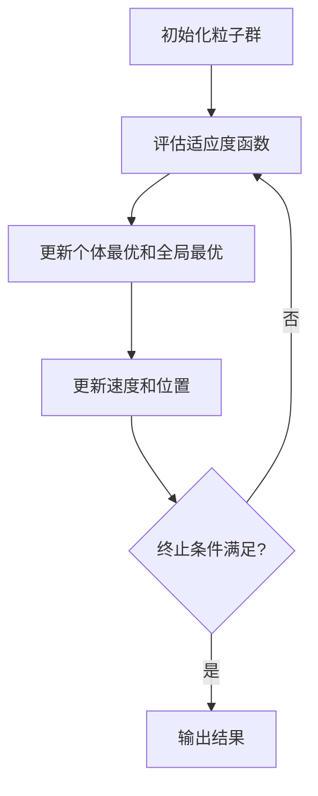

# 粒子群算法

## 基本流程



## 代码
```python
import numpy
import matplotlib.pyplot as plt

# 目标函数
def objectiveFunc(x : numpy.ndarray, _max : bool = True) -> numpy.ndarray:
    return x * numpy.sin(2 * x) - 5 * x * numpy.cos(2 * x) if _max \
        else -1 * (x * numpy.sin(2 * x) - 5 * x * numpy.cos(2 * x))

# 初始化粒子位置和速度
def initialize_particles(n_particles : int, dim : int, lb : float, ub : float) -> [numpy.ndarray]:
    pos = numpy.random.uniform(lb, ub, (n_particles, dim))
    vel = numpy.random.uniform(-1, 1, (n_particles, dim))
    return pos, vel

# 计算适应度值
def calculate_fitness(pos : numpy.ndarray, _max : bool = True) -> numpy.ndarray:
    return objectiveFunc(pos, _max)

# 更新个体最优和全局最优
def update_best_positions(
        pos : numpy.ndarray,
        fitness : numpy.ndarray,
        pbest : numpy.ndarray,
        pbest_value : numpy.ndarray,
        gbest : numpy.ndarray,
        gbest_value : numpy.ndarray,
        _max: bool
) -> [numpy.ndarray]:
    if _max:
        better_idx = fitness > pbest_value
        pbest[better_idx] = pos[better_idx]
        pbest_value[better_idx] = fitness[better_idx]

        current_best_idx = numpy.argmax(fitness)
        current_best_value = fitness[current_best_idx]

        if current_best_value > gbest_value:
            gbest = pos[current_best_idx]
            gbest_value = current_best_value
    else:
        better_idx = fitness < pbest_value
        pbest[better_idx] = pos[better_idx]
        pbest_value[better_idx] = fitness[better_idx]

        current_best_idx = numpy.argmin(fitness)
        current_best_value = fitness[current_best_idx]

        if current_best_value < gbest_value:
            gbest = pos[current_best_idx]
            gbest_value = current_best_value

    return pbest, pbest_value, gbest, gbest_value

# 更新粒子速度和位置
def update_particles(
        pos : numpy.ndarray,
        vel : numpy.ndarray,
        pbest : numpy.ndarray,
        gbest : numpy.ndarray,
        w : float,
        c1 : float,
        c2 : float
) -> [numpy.ndarray]:
    r1 = numpy.random.rand(*pos.shape)
    r2 = numpy.random.rand(*pos.shape)
    vel = (w * vel +
           c1 * r1 * (pbest - pos) +
           c2 * r2 * (gbest - pos))
    pos += vel
    return pos, vel

# 限制粒子位置在边界范围内
def apply_bounds(pos : numpy.ndarray, lb : float, ub : float) -> numpy.ndarray:
    return numpy.clip(pos, lb, ub)

# 粒子群优化主函数
def pso(n_particles : int, n_iterations : int, lb : float, ub : float, _max: bool = True):
    dim = 1  # 只有一个维度

    # 初始化
    pos, vel = initialize_particles(n_particles, dim, lb, ub)
    pbest = pos.copy()
    pbest_value = calculate_fitness(pbest, _max)
    gbest = pbest[numpy.argmax(pbest_value)] if _max else pbest[numpy.argmin(pbest_value)]
    gbest_value = numpy.max(pbest_value) if _max else numpy.min(pbest_value)

    # 用于存储每次迭代的粒子位置
    all_positions = []

    # PSO主循环
    w = 0.5  # 惯性权重，控制速度
    c1 = 1.5  # 个体学习因子，控制个体往自身最佳路径的偏移趋向
    c2 = 1.5  # 社会学习因子，控制个体往全局最佳路径的偏移趋向

    for _ in range(n_iterations):
        all_positions.append(pos.copy())  # 记录每次迭代的粒子位置
        fitness = calculate_fitness(pos, _max)
        pbest, pbest_value, gbest, gbest_value = update_best_positions(
            pos, fitness, pbest, pbest_value, gbest, gbest_value, _max)
        pos, vel = update_particles(pos, vel, pbest, gbest, w, c1, c2)
        pos = apply_bounds(pos, lb, ub)

    return gbest, gbest_value, all_positions

# 参数设置
n_particles = 30  # 粒子数，也就是种群数目
n_iterations = 100  # 迭代次数
lb = -4  # 上下限
ub = 4

# 执行粒子群优化
optimal_x, optimal_f, all_positions = pso(n_particles, n_iterations, lb, ub, _max=True)
print("最优解 x:", optimal_x)
print("最大值:", optimal_f)

# 绘制目标函数和最优解
x = numpy.linspace(-4, 4, 1000)
y = x * numpy.sin(2 * x) - 5 * x * numpy.cos(2 * x)

plt.figure(figsize=(8, 6))
plt.plot(x, y, lw=1)
plt.scatter(optimal_x, optimal_f, c='red', s=100)
plt.show()

```

## 效果
- 红色点即最优解  
 


## 采用Dart的matply库进行测试
```dart
import 'matply.dart';

// 参数设置
const n_particles = 30;  // 粒子数，也就是种群数目
const n_iterations = 100;  // 迭代次数
const lb = -4.0;  // 上下限
const ub = 4.0;

// 目标函数
MatrixType objectiveFunc({required MatrixType x}) => x * (x * 2).sin - x * 5 * (x * 2).cos;

// 初始化粒子位置和速度
List<MatrixType> initialize_particles({
  required int n_particles,
  int dim = 1,
  required double lb,
  required double ub
}){
  final pos = MatrixType.uniform(row: n_particles, column: dim, start: lb, end: ub);
  final vel = MatrixType.uniform(row: n_particles, column: dim, start: -1.0, end: 1.0);
  return [pos, vel];
}

// 计算适应度值
MatrixType calculate_fitness({required MatrixType pos}) => objectiveFunc(x : pos);

List update_best_positions({
  required MatrixType pos,
  required MatrixType fitness,
  required MatrixType pbest,
  required MatrixType pbest_value,
  required double gbest,
  required double gbest_value
}){
  List<List<bool>> better_idx = fitness < pbest_value;
  for (int r = 0;r < better_idx.length;r++){
    for (int c = 0;c < better_idx[0].length;c ++){
      if (better_idx[r][c]){
         pbest[r][c] = pos[r][c];
         pbest_value[r][c] = fitness[r][c];
      }
    }
  }
  int current_best_idx = fitness.argmin(dim: -1) as int;
  double current_best_value = fitness.min(dim: -1) as double;
  if (current_best_value < gbest_value){
        gbest = pos[current_best_idx][0];
        gbest_value = current_best_value;
  }
  return [pbest, pbest_value, gbest, gbest_value];
}

// 更新粒子速度和位置
List<MatrixType> update_particles({
  required MatrixType pos,
  required MatrixType vel,
  required MatrixType pbest,
  required double gbest,
  required double w,
  required double c1,
  required double c2
}) {
    MatrixType r1 = MatrixType.uniform(row: pos.shape[0], column: pos.shape[1]);
    MatrixType r2 = MatrixType.uniform(row: pos.shape[0], column: pos.shape[1]);
    vel = (vel * w + r1 * c1 * (pbest - pos) + r2 * c2 * (pos * (-1) + gbest));
    pos += vel;
    return [pos, vel];
}

// 限制粒子位置在边界范围内
MatrixType apply_bounds({required MatrixType pos, required double lb, required double ub})
=> pos.clip(lb: lb, ub: ub);

// 粒子群优化主函数
List pso({
  required int n_particles,
  required int n_iterations,
  required double lb,
  required double ub
}){
  var a1 = initialize_particles(n_particles:n_particles, dim : 1, lb : lb, ub : ub);
  MatrixType pos = a1[0], vel = a1[1];
  MatrixType pbest = MatrixType.deepCopy(pos);
  MatrixType pbest_value = calculate_fitness(pos: pbest);
  double gbest = pbest[pbest_value.argmin(dim: -1) as int][0];
  double gbest_value = pbest_value.min() as double;
  List<MatrixType> all_positions = [];
  final w = 0.5;  // 惯性权重，控制速度
  final c1 = 1.5;  // 个体学习因子，控制个体往自身最佳路径的偏移趋向
  final c2 = 1.5;  // 社会学习因子，控制个体往全局最佳路径的偏移趋向
  for (int _ = 0;_ < n_iterations;_++){
    all_positions.add(MatrixType.deepCopy(pos));
    MatrixType fitness = calculate_fitness(pos: pos);
    var l = update_best_positions(
        pos: pos,
        fitness:fitness,
        pbest: pbest,
        pbest_value: pbest_value,
        gbest: gbest,
        gbest_value: gbest_value
    );  // return [pbest, pbest_value, gbest, gbest_value]
    pbest = l[0];
    pbest_value = l[1];
    gbest = l[2];
    gbest_value = l[3];
    var l1 = update_particles(pos:pos, vel:vel, pbest:pbest, gbest:gbest, w:w, c1:c1, c2:c2);
    pos = l1[0];
    vel = l1[1];
    pos = apply_bounds(pos:pos,lb: lb,ub: ub);
  }
  return [gbest, gbest_value, all_positions];
}

main(){
  var l = pso(n_particles : n_particles, n_iterations : n_iterations, lb: lb, ub: ub);
  var optimal_x = l[0], optimal_f = l[1], _ = l[2];
  print("最优解 x: $optimal_x");
  print("最小值: $optimal_f");
}

// outputs : 最优解 x: 3.129773849645863
// 最小值: -15.718471132486712
```

<!--  -->