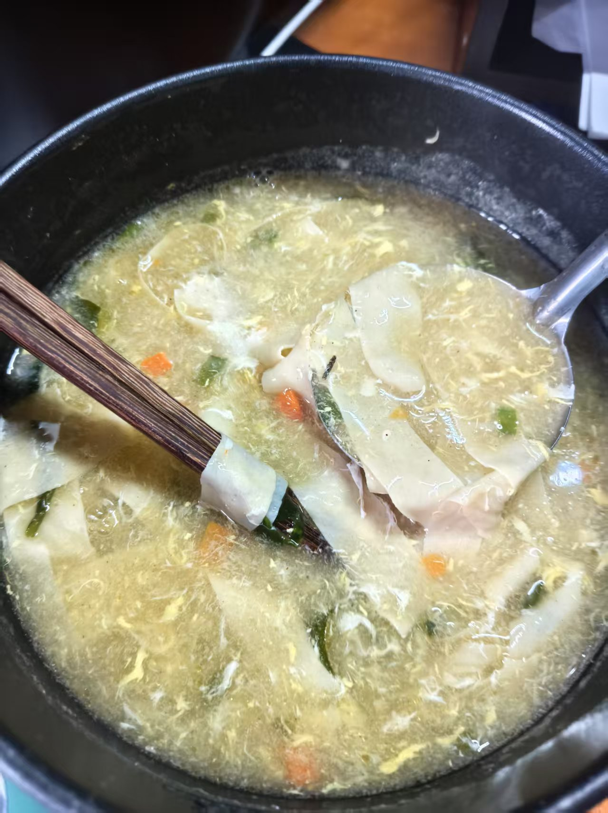

# 类似胡辣汤、豆腐脑卤汁的汤汁设计——改良版

> 前提：备上兰州拉面汤料（网购即可），淀粉（最好是土豆淀粉，玉米淀粉不够粘稠），虾皮（虾皮偏咸，注意调料比例，防止更咸），香油
> 
> 不再需要橄榄油

## 设计

煮水至沸腾前，分别加入葱花、倒点蚝油，豆皮也放进去，沸腾加入汤料粉并且准备调制淀粉（1：4量）勾芡，一定要搅匀淀粉，不然有疙瘩影响口感，放入生鸡蛋液，搅拌，随后倒入淀粉汁并同时搅拌，随后可以放入一些配菜，慢熟的配菜可以提前放，快出锅的时候放入一把虾皮煮一分钟，出锅的时候滴些香油

## 效果
> 这次不错，虾皮提鲜了，颜色比上次淡是因为灯光问题

