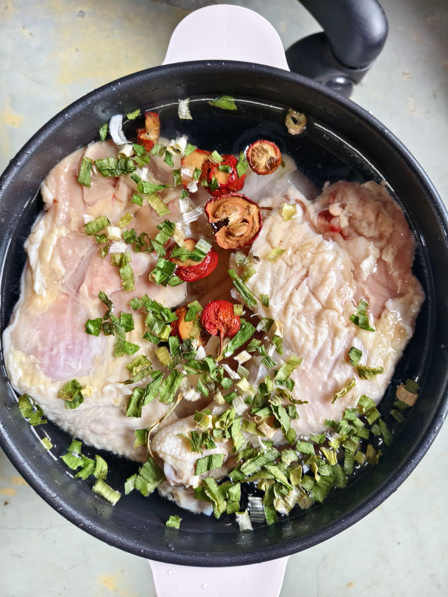
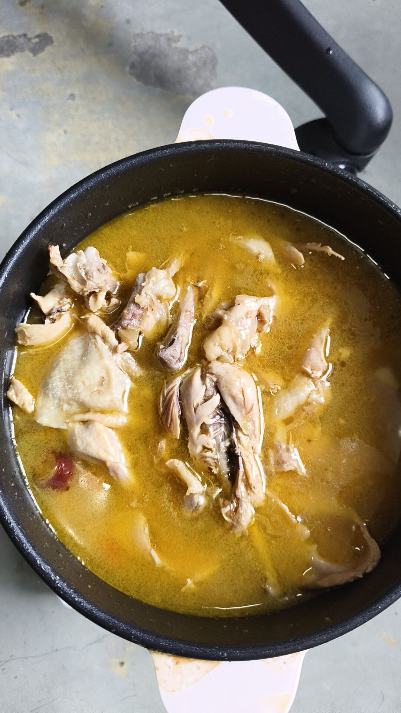

# 卤鸡腿

> 前排提示：其实变成卤手撕鸡腿了；鸡腿买的冷冻的，两斤4个，琵琶腿

## 设计

> 核心：海底捞的三鲜上汤火锅底料

温水泡软，然后大火上锅，放一把香葱干和山楂，两块冰糖，途中捞出血沫，待到水沸腾，放入火锅底料，滴入少量蚝油，5g米醋，大火炖煮20分钟，这时候内部不熟，然后取出放凉手撕，再炖煮15分钟左右，这汤香的可以留着煮面充味增了

## 效果
> 效果：由于用料中含有香菇，吃起来像香菇炖鸡，浸味了且吃起来不腻😋

