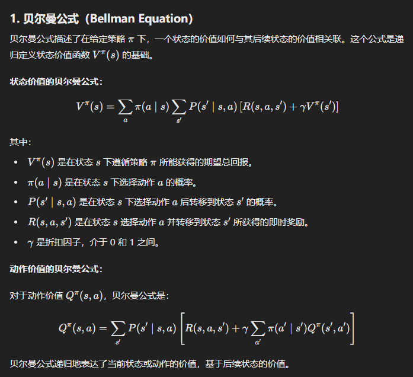
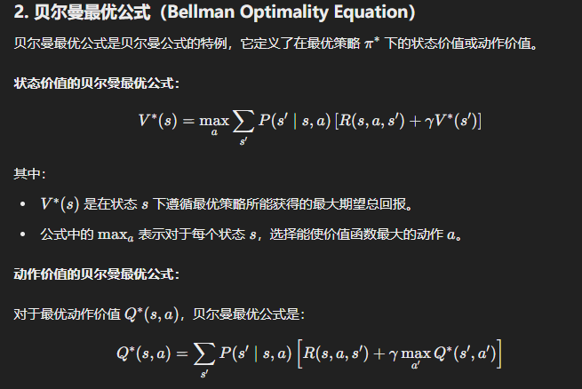
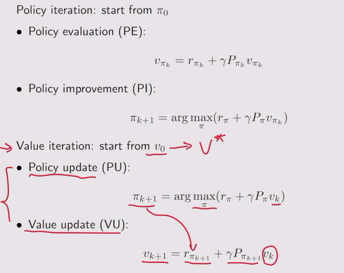
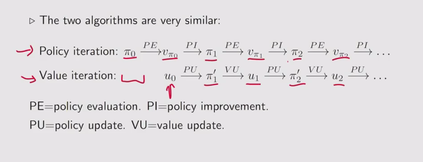
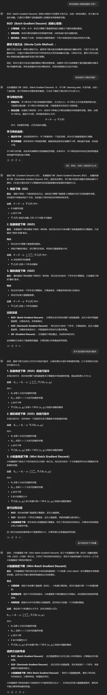
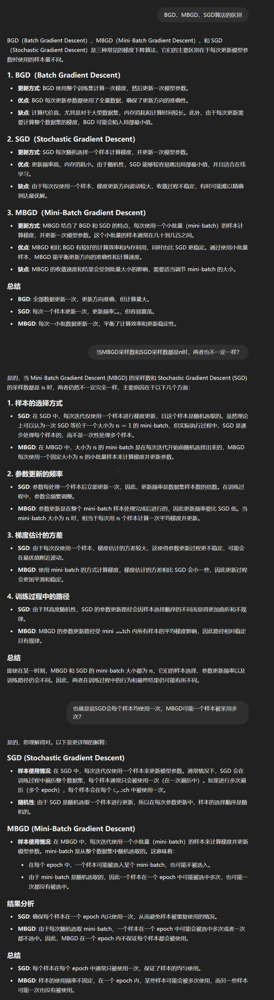
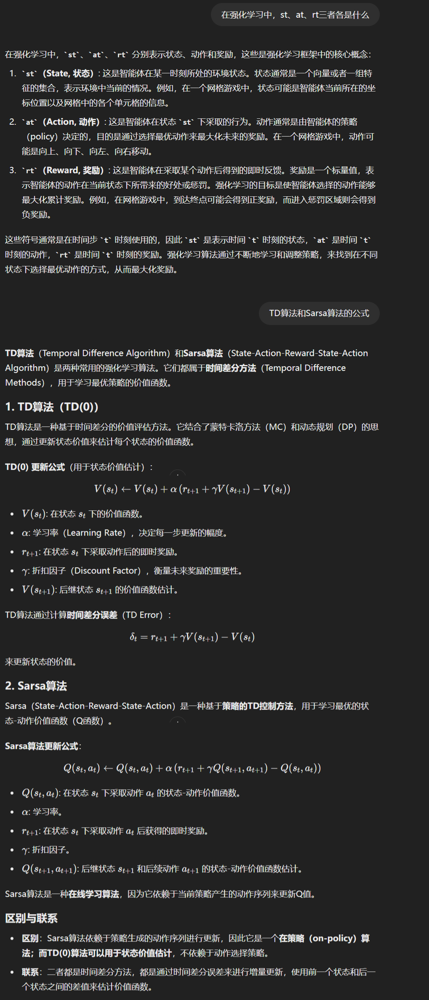

# 强化学习
目的是找到最优策略

# MDP

马尔科夫决策过程，以下是其重要组成

* **状态集合（States, S）**: 系统可能处于的所有状态的集合。
* **动作集合（Actions, A）**: 在每个状态下可以采取的所有可能动作的集合。
* **奖励函数（Reward, R）**: 在状态 s下采取动作 a 后得到的即时奖励。
* **状态转移概率（Transition Probability, P）**: 描述在某个状态采取某个动作后。
* **折扣因子（Discount Factor, γ）**: 用于折扣未来奖励的值，范围在 0 到 1 之间。折扣因子 γ 越接近于 1，表示未来的奖励对当前决策的影响越大。
* **策略(Policy, π(a∣s))**: 策略是指在某个状态 𝑠 下选择某个动作 a 的概率分布。策略可以是确定性的（即每个状态对应一个固定动作），也可以是随机性的（即每个状态对应一组动作的概率分布）。在强化学习中，策略是寻找最优决策的核心目标。
* **马尔可夫属性（Markov Property）**: 马尔可夫属性（Markov Property） 是一种描述随机过程特性的条件独立性属性。它表示一个系统的未来状态只依赖于它的当前状态，而与过去的状态无关。这意味着在给定当前状态的条件下，未来状态的概率分布完全由当前状态决定，而与之前的历史状态无关。换句话说，如果一个随机过程具有马尔可夫属性，那么只需要知道当前的状态 就可以预测未来的状态 ，而不需要考虑之前的状态序列。马尔可夫属性的核心在于“无记忆性”——当前状态已经包含了所有有关未来的信息，过去的信息对预测未来没有额外的帮助。

# 贝尔曼公式

> 注：
> * 贝尔曼最优公式一定有解
> * 贝尔曼最优解是唯一的，但是策略不一定是唯一的

## 策略迭代和值迭代的方式

# 蒙特卡洛估计核心思想
蒙特卡洛估计是强化学习中一种利用随机采样来估计期望值的方法。它的核心思想是通过在环境中模拟和采样，来计算状态或状态-动作对的价值估计。
> 举个例子：抛硬币求期望——若知道硬币有两面（模型），则可以正常求；若不知道，则可以通过大量实验抛硬币取均值估算

# 梯度下降

# Saras算法
